### S.O. 2025.1 - Atividade 05
# **Relatório de atividades práticas: Comunicação entre Tarefas**
### Aluno: Josephy Cruz Araújo 
### Data: 13/06/2025

## Introdução: 
Esta atividade teve como objetivo implementar e comparar dois modelos de comunicação entre tarefas:

1 . Processos independentes (comunicação via Kernel: memória compartilhada, pipes)
2. Threads (comunicação via memória compartilhada no mesmo processo)

Os programas utilizados foram testados em um ambiente Docker, analisando-se:

- Complexidade de implementação
- Tempo de execução
- Eficiência na comunicação

## Relato:
### 1. Criação do Dockerfile, construção da imagem Docker e execução do contêiner com volume: 
Assim como nas outras duas atividades, o exercício foi iniciado com um fork do repositório e criando uma pasta intitulada **"docker_practice"**, e dentro dela foi criando um arquivo dockerfile. 

A principio, nessa pasta também foi inclúido os arquivo **"writer-file.c"**, **"reader-file.c"**, **"writer-mem.c"**, **"reader-mem.c"**, presentes no readme e necessários à execução do que foi protosto para o exercício. 

Conteúdo do writer-file
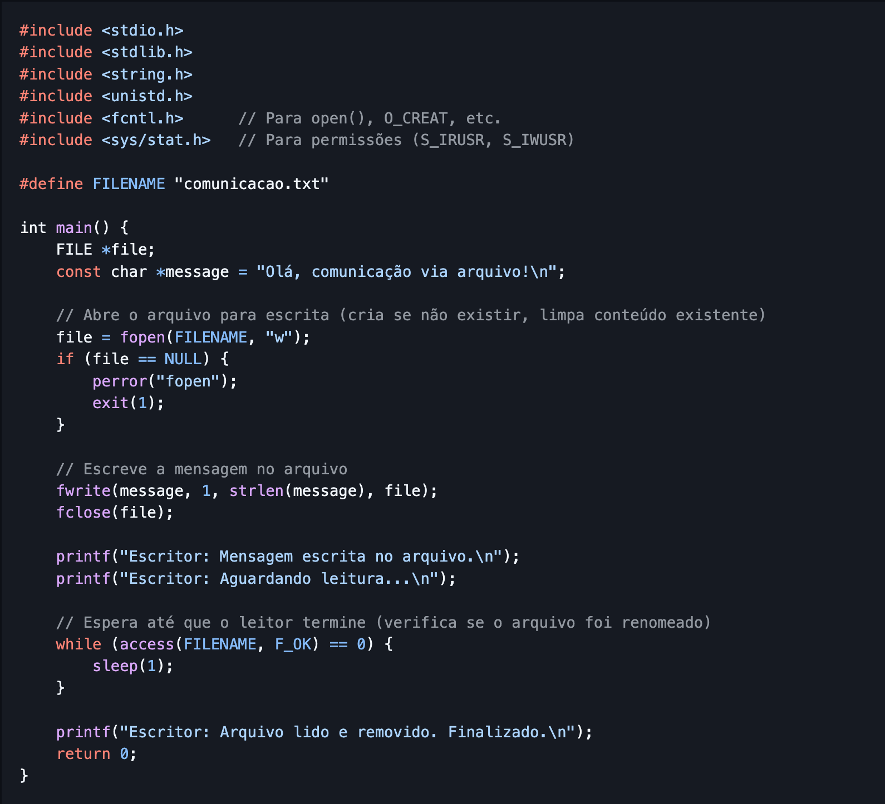

Conteúdo do reader-file
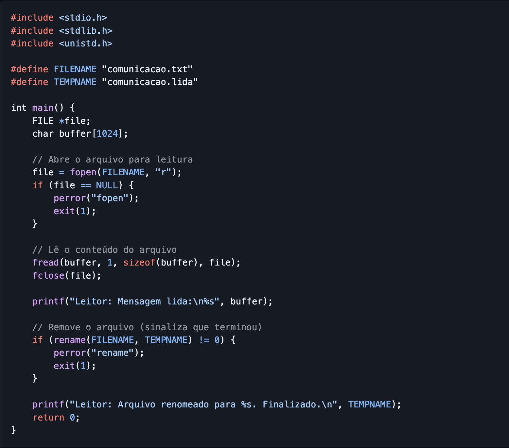

Conteúdo do writer-mem
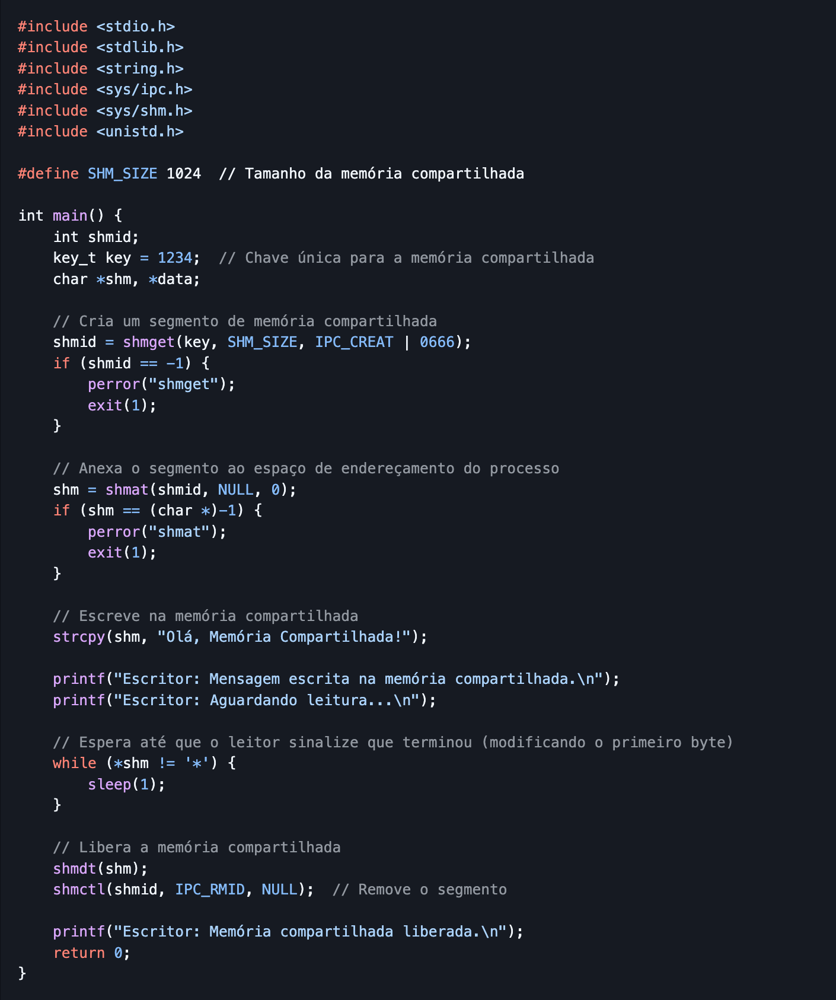

Conteúdo do reader-mem
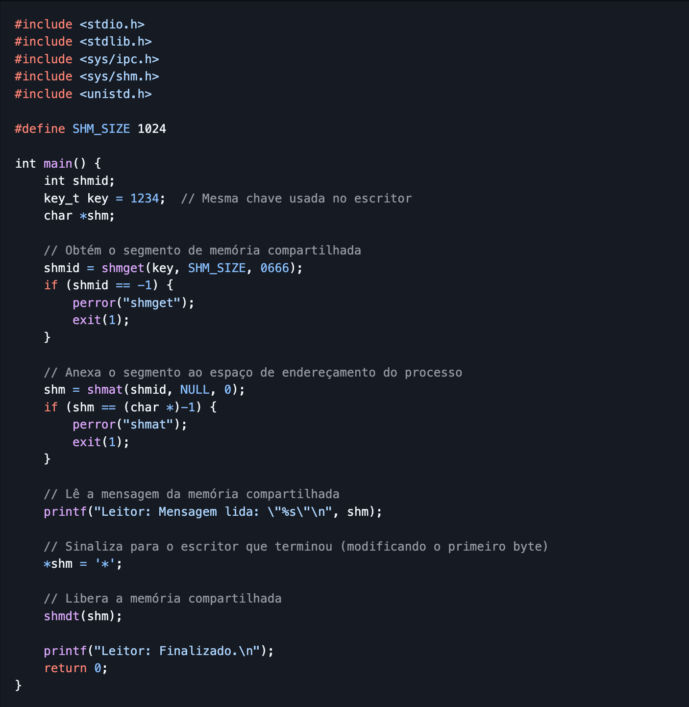

Nesse exércio não foi necessário criar um contêiner Docker com a imagem do Fedora utilizando Power Shell, pois reutilzei o já existente da atividade 4. Iniciei o contêiner executando o comando **"docker run -it --name escalonamento -v "${PWD}:/app" fedora-sistemas-operacionais fish**. O terminal interativo do Fish shell foi iniciado.

### 2. Compilação e Execução dos Programas em C - Comunicação via Processos (Kernel):
Após a verificação do conteúdo do armazenado no diretório procedi com a compilação dos arquivos e já executei o primeiro programa, o **"writer-file.c"**, usando a comando **"time"** já para retorna o tempo gasto para exeucção do código. 
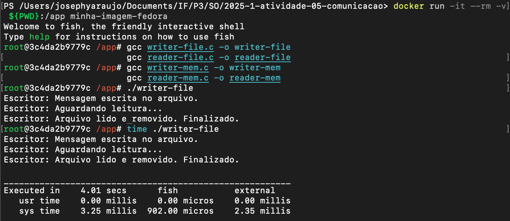

Em seguida executei da mesma forma o **"reader-file.c"**. 
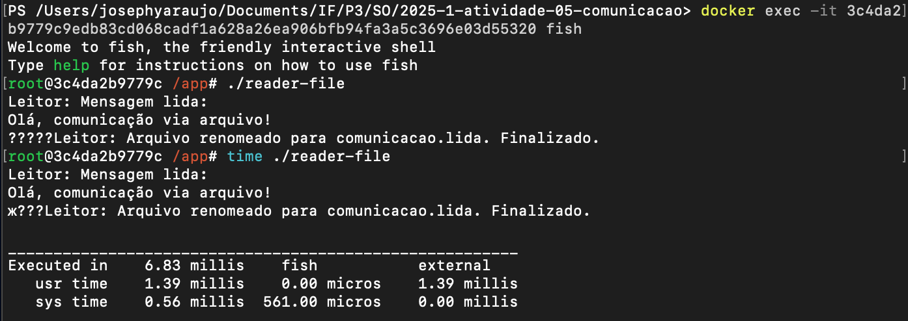

É importante salienter que a execução do programa **"reader-file.c"** ocorreu em um segundo terminal, executei o comando **"docker exec -it <id_do_conteiner> fish"** para inicializar outro terminal interativo Fish Shell dentro do mesmo contêiner. Antes eu não estava fazendo dessa forma, o que impactou a execução, não desse programa, mas os que vem em seguida, que usam memória compatilhada (writer-mem.c e reader-mem.c).

Dando seguimento, executei os programas **"writer-mem.c"** e **"reader-mem.c"**. 

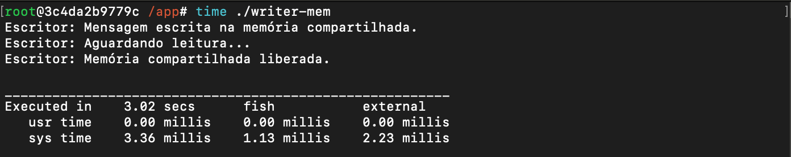

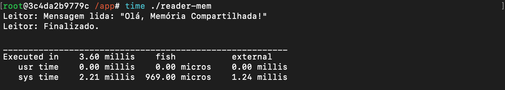

### 3. Comunicação via Threads:
Nessa etapa do exercício, com auxílio do Deepseek, uni os dois códigos writer e reader, tanto do file, quanto do mem, para criar programas que utilizassem threads em sua execução.  

Para os testes foram utilizados os programas: **"reader-writer-thread.c"**, **"reader-writer-mem-thread.c"**, **"file_threads.c"**, **"mem_threads.c"**. Os códigos estão disponíveis no reposítório para consulta. Todos os programas foram compilados e em seguidas executados no contêiner Docker. 

Execução do reader-writer-thread.c
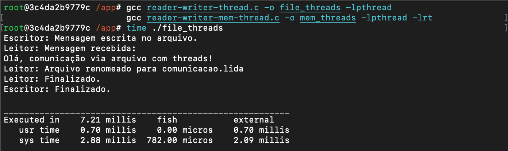

Execução do reader-writer-mem-thread.c
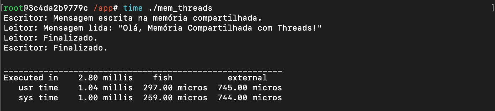

Execução do file_thread.c
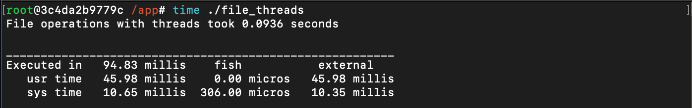

Execução do mem_thread.c
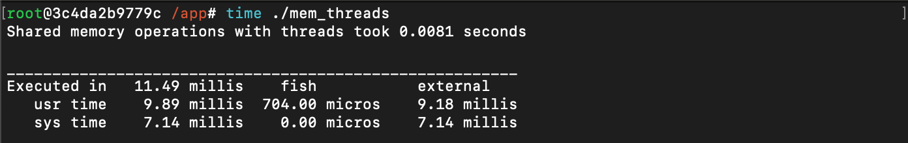

### Análise dos resultados e Conclusões:
Como é possível observar, ao mensurar o tempo gasto na execução pelos programas que usam threads, em comparação com os programas que usam comunicação via kernel, estes primeiros se mostram mais rapidos, chegando a tempos 4x menores devido à ausência de chamadas ao Kernel, como no caso da execução do **reader-writer-mem-thread**, que só consumiu 1 milissegundo do tempo do sistema. 

**Aprendizados:**
- Comunicação entre Processos vs. Threads: Threads são significativamente mais eficientes para comunicação dentro do mesmo processo. Por sua vez os processos de comunicação via Kernel oferecem maior isolamento e segurança, mas exigem mecanismos que aumentam a complexidade e o tempo de sistema. 

- Impacto do Escalonador: O escalonador do Linux prioriza threads em modo usuário (user), enquanto operações de I/O ou IPC (em sys) introduzem atrasos mensuráveis.

- Uso de Docker para Ambientes Isolados: Aprendi a gerenciar recursos compartilhados (memória) dentro de um único contêiner, evitando a armadilha de criar múltiplos contêineres para programas interdependentes.

**Dificuldades:**
- Comunicação entre Contêineres: como supracitado inicialmente, tentei executar writer-mem e reader-mem em contêineres separados, o que falhou, porque a memória compartilhada requer o mesmo espaço de endereçamento. Para corrigir esse problema utilizei docker exec -it para abrir terminais adicionais no mesmo contêiner (lição aprendida na atividade 4).

Portanto, a atividade reforçou a importância de escolher o modelo de comunicação adequado ao cenário, equilibrando velocidade, isolamento e complexidade.
